# CloudGuardian

## Intelligent CloudOps Incident Detection, Diagnosis, Controlled Remediation and Recovery

CloudGuardian is a practical AWS-based CloudOps platform that helps
detect infrastructure problems, understand what is wrong, apply a
controlled recovery action, and verify that the service is healthy
again.

The project is designed around one simple operational flow:

**Detect → Diagnose → Assess Risk → Approve → Remediate → Verify**

Instead of giving an operator a raw alert and asking them to investigate
everything manually, CloudGuardian turns the alert into a structured
incident and guides it through a controlled recovery process.

------------------------------------------------------------------------

## 1. The problem

Cloud infrastructure can fail in many small ways:

-   CPU usage becomes unusually high.
-   A service stops running.
-   Memory or disk usage becomes excessive.
-   A deployment leaves an application unhealthy.
-   A health check starts failing.

A typical manual response looks like this:

1.  Notice an alert.
2.  Open the AWS console.
3.  Find the affected server.
4.  Check metrics and logs.
5.  Decide what the problem probably is.
6.  Decide what action is safe.
7.  Connect to the server.
8.  Restart or repair the service.
9.  Check whether the service recovered.

This process is repetitive and can become slow during an incident.

CloudGuardian automates the repeatable parts while keeping a human in
control of risky actions.

------------------------------------------------------------------------

## 2. What CloudGuardian does

CloudGuardian connects AWS monitoring with a small incident-management
and remediation engine.

When an AWS alarm occurs:

1.  **CloudWatch** detects the problem.
2.  **EventBridge** routes the alarm event.
3.  **API Gateway** provides the HTTPS entry point.
4.  **FastAPI** receives and creates the incident.
5.  The diagnosis layer searches relevant operational runbooks and
    applies incident rules.
6.  The risk engine determines whether the proposed action requires
    approval.
7.  Sensitive actions wait for human approval.
8.  **AWS Systems Manager (SSM)** executes an allowlisted action on the
    EC2 instance.
9.  CloudGuardian verifies the service recovery.
10. The incident is marked as resolved or failed and the important
    events are recorded.

------------------------------------------------------------------------

## 3. Architecture

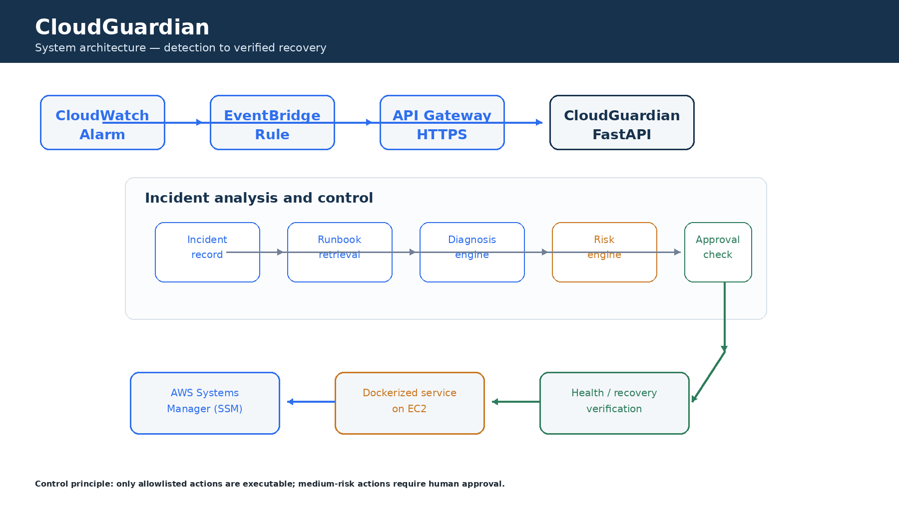

### Architecture in plain English

  -----------------------------------------------------------------------
  Component                           Purpose
  ----------------------------------- -----------------------------------
  Amazon CloudWatch                   Watches AWS metrics and raises
                                      alarms

  Amazon EventBridge                  Routes matching AWS events

  Amazon API Gateway                  Provides the HTTPS API entry point

  FastAPI                             Runs the CloudGuardian application

  Runbooks                            Provide operational knowledge for
                                      diagnosis

  Diagnosis engine                    Converts an incident into a
                                      probable cause and recommendation

  Risk engine                         Classifies actions and determines
                                      whether approval is required

  Human approval                      Prevents sensitive actions from
                                      executing automatically

  AWS Systems Manager                 Runs approved commands on the EC2
                                      instance

  Amazon EC2                          Hosts the containerized
                                      CloudGuardian service

  Docker                              Packages the application
                                      consistently

  Amazon ECR                          Stores the Docker image

  GitHub Actions                      Runs CI, security scanning, and
                                      image publishing

  Trivy                               Scans the container image for known
                                      vulnerabilities
  -----------------------------------------------------------------------

------------------------------------------------------------------------

## 4. End-to-end workflow

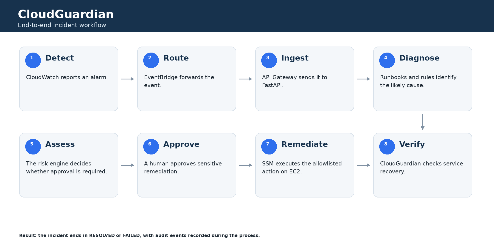

### Example

Imagine an EC2 service becomes unhealthy.

CloudWatch detects the abnormal condition and raises an alarm.

EventBridge forwards the alarm to CloudGuardian through API Gateway.

CloudGuardian creates an incident such as:

``` text
Type:       SERVICE_DOWN
Severity:   HIGH
Status:     DIAGNOSED
```

The diagnosis layer checks the incident and relevant runbooks.

It may recommend:

``` text
Inspect recent service logs and restart the allowlisted
service after approval.
```

The risk engine classifies the restart operation as a controlled action
that requires human approval.

After approval, CloudGuardian sends the allowlisted action to AWS
Systems Manager.

SSM executes the action on the EC2 instance.

CloudGuardian then performs recovery verification.

If the service is healthy:

``` text
Status: RESOLVED
```

If verification fails:

``` text
Status: FAILED
```

This makes the remediation process observable instead of treating a
successful command execution as proof that the incident is fixed.

------------------------------------------------------------------------

## 5. Controlled remediation

A major design principle of the project is:

> CloudGuardian does not accept arbitrary shell commands from the API.

Remediation actions are explicitly registered in the application.

The current allowlisted actions include:

``` text
collect_logs
verify_recovery
restart_service
inspect_and_restart_service
```

The risk engine assigns a risk level to each action.

For example:

``` text
collect_logs
    ↓
LOW
    ↓
No human approval required
```

Whereas:

``` text
restart_service
    ↓
MEDIUM
    ↓
Human approval required
    ↓
SSM execution
    ↓
Recovery verification
```

This prevents an external API request from turning directly into
arbitrary command execution on the server.

------------------------------------------------------------------------

## 6. Diagnosis and runbooks

CloudGuardian keeps operational knowledge in a local `runbooks/`
directory.

Instead of storing troubleshooting instructions only in the application
code, the system can search the available runbooks for terms related to
the incident.

For example:

``` text
Incident:
HIGH_CPU

Description:
CPU utilization is above the configured threshold.
```

The diagnosis layer can retrieve relevant runbook material and combine
that evidence with the incident type and available metrics.

The current implementation uses deterministic diagnosis rules and local
runbook retrieval. It does not require an external LLM API to perform
the demonstrated workflow.

This makes the system:

-   predictable
-   inexpensive to run
-   easy to test
-   easy to explain
-   independent of an external AI provider

------------------------------------------------------------------------

## 7. Human approval

Not every recovery action should happen automatically.

CloudGuardian separates observation from execution.

A typical incident can move through:

``` text
DETECTED
   ↓
INVESTIGATING
   ↓
DIAGNOSED
   ↓
AWAITING_APPROVAL
   ↓
REMEDIATING
   ↓
VERIFYING
   ↓
RESOLVED
```

If an operator rejects the proposed action, the incident can instead
move to a failed or stopped state.

The approval record stores:

-   incident ID
-   requested action
-   approver
-   approval decision
-   timestamp

This creates a basic audit trail around operational changes.

------------------------------------------------------------------------

## 8. AWS infrastructure

The demonstrated deployment uses AWS services in the `ap-south-1`
region.

### Main AWS services

``` text
Amazon VPC
    └── EC2
         ├── Docker
         ├── CloudGuardian
         └── AWS Systems Manager

Amazon CloudWatch
    ↓
Amazon EventBridge
    ↓
Amazon API Gateway
    ↓
CloudGuardian API
```

### EC2

The application is deployed as a Docker container on an Ubuntu EC2
instance.

The container exposes the FastAPI application on port `8000` internally
and is published through port `80` on the EC2 host.

### Systems Manager

SSM is used for controlled remote execution.

This avoids placing SSH-based remediation logic inside the application
and allows the EC2 instance to be managed through an AWS-native control
plane.

### ECR

The Docker image is stored in Amazon Elastic Container Registry.

The deployment process pulls the latest approved image from ECR before
starting the application container.

------------------------------------------------------------------------

## 9. CI/CD pipeline

The project uses GitHub Actions for continuous integration and
deployment.

The pipeline performs the following stages:

``` text
Git push
   ↓
Python checks
   ↓
pytest
   ↓
Ruff
   ↓
Trivy security scan
   ↓
Docker build
   ↓
Amazon ECR login
   ↓
Docker image push
```

AWS authentication from GitHub Actions uses GitHub OIDC rather than
storing long-lived AWS access keys in the repository.

The deployment workflow is therefore based on short-lived AWS
credentials issued to the GitHub Actions identity.

------------------------------------------------------------------------

## 10. Security model

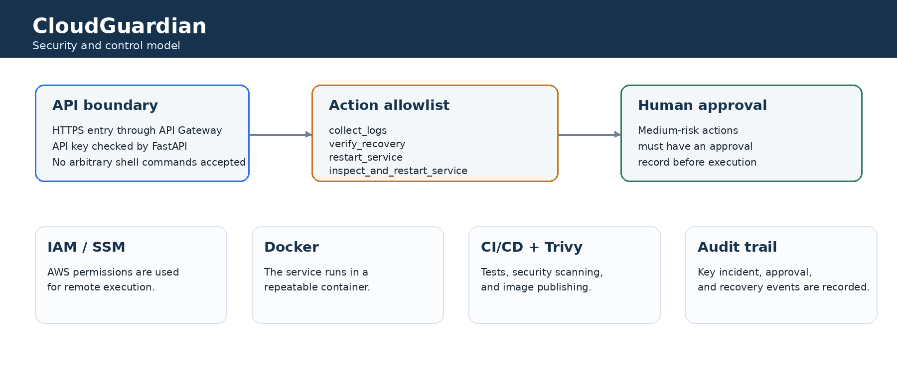

CloudGuardian applies several basic security controls:

### API authentication

The CloudWatch event ingestion endpoint requires an API key.

The key is supplied through the HTTP header rather than being embedded
in the request body.

### Secret handling

Runtime secrets are kept outside the Git repository.

The deployed EC2 service loads its runtime secret configuration from a
protected environment file.

`.env` files and other secret-bearing files should never be committed.

### Allowlisted actions

The remediation engine does not execute arbitrary commands supplied by
API clients.

Only registered actions can reach the SSM execution layer.

### Risk-based approval

Actions can be classified by risk.

Sensitive actions require an approval record before execution.

### IAM

AWS permissions are granted through IAM roles rather than hard-coded AWS
credentials inside application code.

### Container security

The CI/CD workflow includes Trivy container image scanning before the
image is published.

------------------------------------------------------------------------

## 11. Observability

CloudGuardian exposes basic operational endpoints:

``` text
GET /health
GET /ready
GET /metrics
```

The health endpoint provides a simple service-level check.

Example:

``` json
{
  "status": "ok",
  "service": "CloudGuardian",
  "version": "1.0.1"
}
```

The application also exposes Prometheus-compatible metrics through
`/metrics`.

------------------------------------------------------------------------

## 12. API

The main API is documented automatically through FastAPI's
Swagger/OpenAPI interface.

Open:

``` text
http://<host>/docs
```

### Main endpoints

  ------------------------------------------------------------------------------------
  Method                  Endpoint                             Purpose
  ----------------------- ------------------------------------ -----------------------
  GET                     `/health`                            Service health check

  GET                     `/ready`                             Readiness check

  GET                     `/metrics`                           Prometheus-compatible
                                                               metrics

  GET                     `/api/v1/incidents`                  List incidents

  POST                    `/api/v1/incidents`                  Create an incident
                                                               manually

  GET                     `/api/v1/incidents/{id}`             Get incident details

  POST                    `/api/v1/incidents/{id}/diagnose`    Diagnose an incident

  POST                    `/api/v1/incidents/{id}/approve`     Approve or reject an
                                                               action

  POST                    `/api/v1/incidents/{id}/remediate`   Execute an approved
                                                               action

  POST                    `/api/v1/incidents/{id}/verify`      Verify recovery

  GET                     `/api/v1/aws/status/{instance_id}`   Read EC2 status

  GET                     `/api/v1/aws/cpu/{instance_id}`      Read CPU information

  POST                    `/api/v1/events/cloudwatch`          Receive CloudWatch
                                                               events
  ------------------------------------------------------------------------------------

------------------------------------------------------------------------

## 13. Technology stack

### Application

-   Python
-   FastAPI
-   Pydantic
-   boto3
-   pytest
-   Ruff

### AWS

-   Amazon EC2
-   Amazon VPC
-   Amazon CloudWatch
-   Amazon EventBridge
-   Amazon API Gateway
-   AWS Systems Manager
-   Amazon ECR
-   AWS IAM

### DevOps

-   Docker
-   GitHub
-   GitHub Actions
-   GitHub OIDC
-   Trivy

### Application knowledge

-   Local Markdown runbooks
-   Deterministic diagnosis rules
-   Controlled remediation engine
-   Risk and approval engine
-   In-memory incident store for the demonstrated application

------------------------------------------------------------------------

## 14. Repository structure

``` text
cloudguardian/
│
├── backend/
│   ├── app/
│   │   ├── api/
│   │   ├── models/
│   │   ├── schemas/
│   │   ├── services/
│   │   └── main.py
│   │
│   ├── tests/
│   └── requirements.txt
│
├── dashboard/
│
├── docs/
│
├── examples/
│
├── runbooks/
│
├── scripts/
│
├── terraform/
│
├── .github/
│   └── workflows/
│
├── Dockerfile
├── docker-compose.yml
├── deploy.sh
├── .env.example
└── README.md
```

The most important application code is inside `backend/app`.

------------------------------------------------------------------------

## 15. Local setup

### Requirements

Install:

-   Python 3.13 or compatible Python 3.x version supported by the
    project
-   Git
-   Docker, if using the container workflow
-   AWS credentials or an IAM role when testing real AWS functionality

### Clone the repository

``` bash
git clone https://github.com/senthamizhvelan04/cloudguardian.git
cd cloudguardian
```

### Create a virtual environment

Windows PowerShell:

``` powershell
cd backend
python -m venv .venv
.\.venv\Scripts\Activate.ps1
```

Linux/macOS:

``` bash
cd backend
python3 -m venv .venv
source .venv/bin/activate
```

### Install dependencies

``` bash
pip install -r requirements.txt
```

### Configure environment

Create a local `.env` file from the example configuration.

Do not commit the real `.env` file.

For local development, AWS integration can remain disabled so that the
application does not make real AWS calls.

### Start the API

``` bash
uvicorn app.main:app --reload
```

Open:

``` text
http://127.0.0.1:8000/docs
```

------------------------------------------------------------------------

## 16. Docker

Build the application:

``` bash
docker build -t cloudguardian:latest .
```

Run it:

``` bash
docker run -d \
  --name cloudguardian \
  -p 80:8000 \
  cloudguardian:latest
```

Check:

``` bash
curl http://localhost/health
```

Expected result:

``` json
{
  "status": "ok",
  "service": "CloudGuardian",
  "version": "1.0.1"
}
```

------------------------------------------------------------------------

## 17. Deployment flow

The demonstrated AWS deployment follows this sequence:

``` text
Developer
   ↓
GitHub
   ↓
GitHub Actions
   ↓
Tests + Ruff + Trivy
   ↓
Docker build
   ↓
Amazon ECR
   ↓
EC2 deployment
   ↓
Docker container
   ↓
CloudGuardian API
```

For the deployed environment, the EC2 host pulls the container image
from ECR and starts the service using the deployment script.

------------------------------------------------------------------------

## 18. Testing

The project includes automated tests for the application logic.

Run:

``` bash
pytest
```

The completed local validation included passing application tests.

Static checks are performed through Ruff:

``` bash
ruff check .
```

The GitHub Actions pipeline also performs container security scanning
with Trivy.

------------------------------------------------------------------------

## 19. Demonstration screenshots

The following screenshots document the implemented project.

### GitHub repository

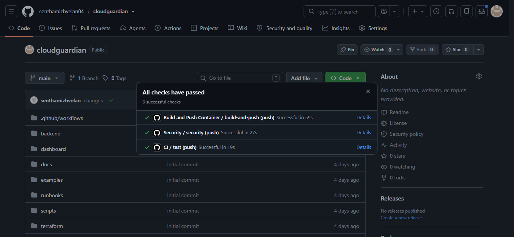

The repository contains the application, workflows, documentation,
runbooks, deployment files and supporting directories.

### Amazon ECR

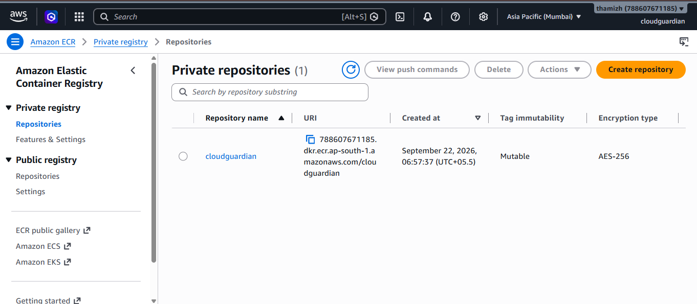

The Docker image is stored in Amazon ECR before deployment to EC2.

### EC2 deployment

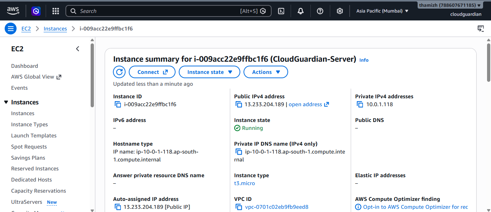

The CloudGuardian server is running on an EC2 instance.

### Application health

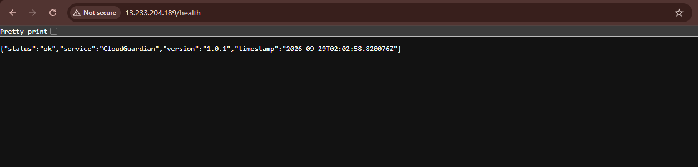

The deployed service responds successfully to the health check.

### FastAPI documentation

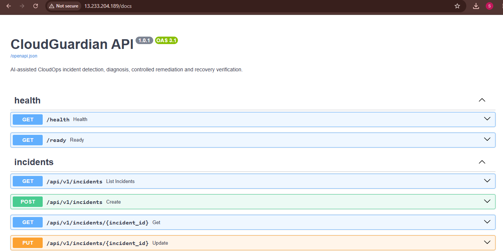

FastAPI automatically provides an interactive OpenAPI/Swagger interface
for testing the API.

### API routes

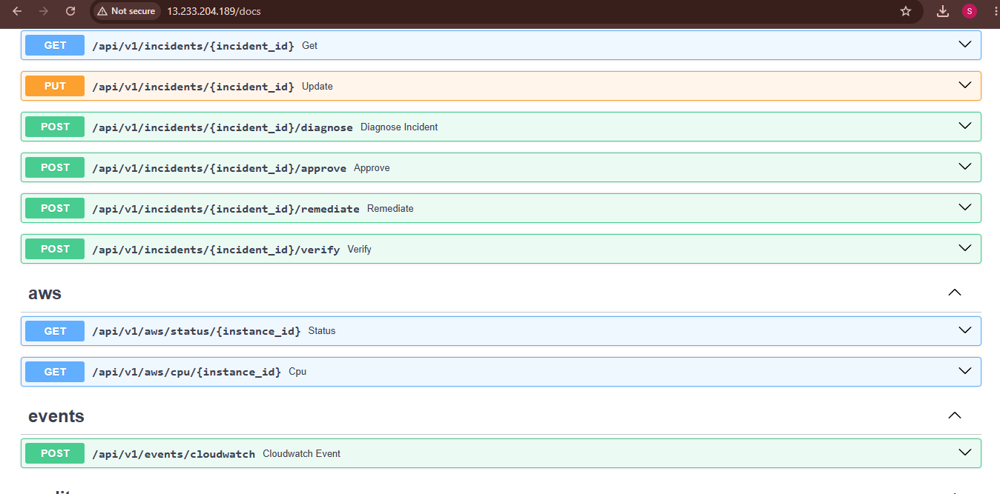

The API exposes incident, AWS, verification, approval, remediation and
event-ingestion operations.

### Incident API result

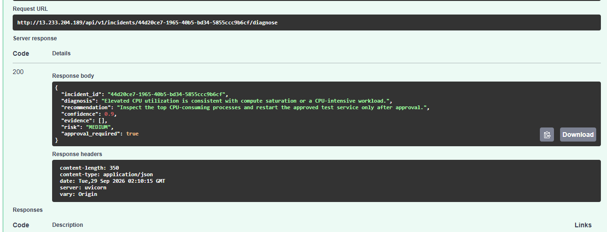

An API request creates and returns a structured incident.

### Diagnosis result

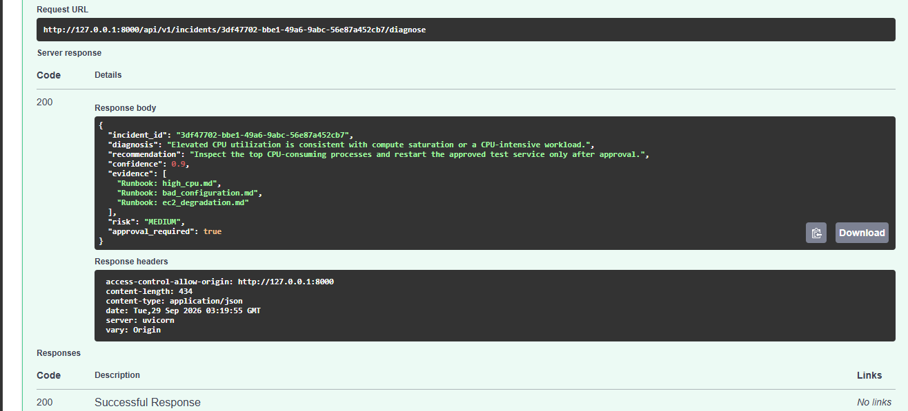

The response contains diagnosis information, recommendation, confidence
and incident state.

### Remediation result

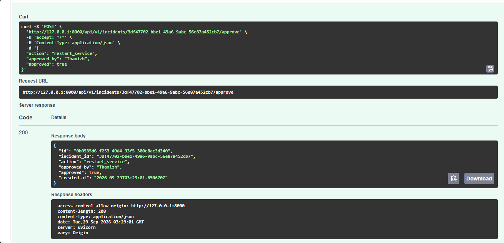

The remediation workflow returns the action result and execution
information.

### Recovery verification

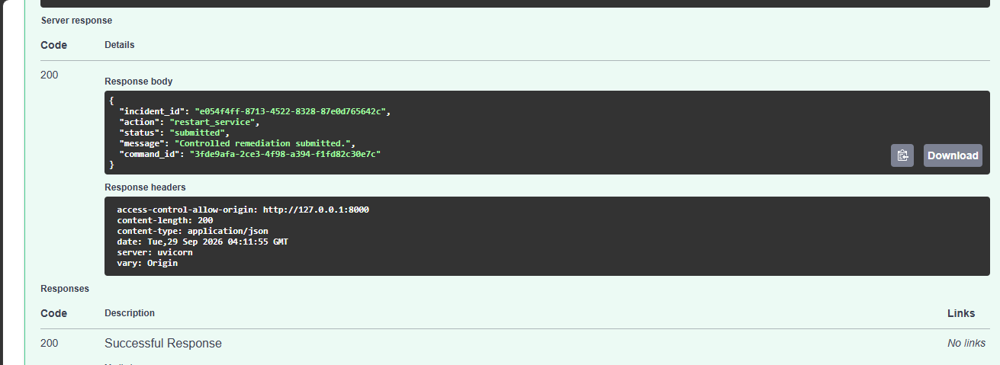

The final stage verifies that the service has recovered.

------------------------------------------------------------------------

## 20. What this project demonstrates

This project brings together several practical Cloud and DevOps concepts
in one system:

### Cloud

-   EC2
-   VPC
-   IAM
-   CloudWatch
-   EventBridge
-   API Gateway
-   Systems Manager
-   ECR

### DevOps

-   Git
-   GitHub
-   GitHub Actions
-   CI/CD
-   Docker
-   Container registry
-   Automated testing
-   Security scanning

### CloudOps / SRE concepts

-   Incident detection
-   Incident lifecycle
-   Diagnosis
-   Runbooks
-   Risk classification
-   Human approval
-   Controlled remediation
-   Recovery verification
-   Audit events
-   Health checks
-   Metrics

### Backend development

-   FastAPI
-   REST APIs
-   Pydantic validation
-   API authentication
-   Service-layer design
-   Error handling
-   Automated tests

------------------------------------------------------------------------

## 21. Design decisions

### Why FastAPI?

FastAPI provides a lightweight way to expose the incident engine as a
REST API and automatically generates OpenAPI documentation.

### Why Docker?

Docker packages the application and its Python dependencies into a
repeatable deployment unit.

### Why ECR?

ECR provides a private AWS-native registry for the container image used
by the EC2 deployment.

### Why SSM instead of SSH automation?

SSM provides an AWS-native mechanism for executing approved commands on
managed instances without making SSH the application's remediation
interface.

### Why human approval?

Restarting or changing a production service is different from collecting
diagnostic information. The project therefore separates low-risk
evidence gathering from sensitive recovery actions.

### Why allowlisted actions?

An incident automation system should not accept an arbitrary command
from an HTTP request and execute it on a server. An explicit action
allowlist limits what the remediation engine can perform.

------------------------------------------------------------------------

## 22. Current limitations

The project is intentionally focused on demonstrating the core CloudOps
workflow.

Current limitations include:

-   Incident state is stored in memory for the demonstrated application
    flow.
-   The deployed demo uses a single EC2 application host.
-   The API Gateway integration depends on the reachable EC2 endpoint
    used during deployment.
-   The diagnosis layer is deterministic and runbook-based rather than
    dependent on a hosted generative AI model.
-   The remediation action set is intentionally small.
-   A production deployment would require stronger secret management,
    persistent storage, high availability, tighter network controls and
    more comprehensive observability.

These limitations are deliberate boundaries for the project rather than
hidden assumptions.

------------------------------------------------------------------------

## 23. Future improvements

Possible next steps include:

1.  Persistent incident storage using PostgreSQL or DynamoDB.
2.  A dedicated dashboard for incident history and approval state.
3.  Additional safe remediation actions.
4.  Better EventBridge event normalization.
5.  More detailed CloudWatch metric correlation.
6.  Multi-instance remediation.
7.  AWS Secrets Manager integration.
8.  Private networking between API Gateway and the application.
9.  Multi-AZ deployment.
10. Expanded automated test coverage.
11. More advanced runbook retrieval.
12. Optional integration with a managed LLM for natural-language
    diagnosis, with strict action controls remaining in place.

------------------------------------------------------------------------

## 24. Project status

The demonstrated CloudGuardian implementation includes:

-   FastAPI backend
-   AWS integration
-   EC2 deployment
-   Docker containerization
-   ECR image publishing
-   GitHub Actions CI/CD
-   GitHub OIDC authentication
-   Trivy security scanning
-   CloudWatch integration
-   Event-driven API ingestion
-   Runbook-based diagnosis
-   Risk classification
-   Human approval
-   AWS Systems Manager remediation
-   Recovery verification
-   API authentication
-   Health and metrics endpoints

The project is intended as a hands-on CloudOps and DevOps portfolio
project demonstrating how monitoring, backend engineering, AWS services,
containers, CI/CD and controlled remediation can work together.

------------------------------------------------------------------------

## 25. Repository

GitHub:

https://github.com/senthamizhvelan04/cloudguardian

------------------------------------------------------------------------

## 26. Author

**Thamizh**

Final-year Engineering Student --- Artificial Intelligence & Data
Science

Interested in Cloud, DevOps, CloudOps and infrastructure automation.

------------------------------------------------------------------------

## License

See the repository `LICENSE` file for the applicable license.
